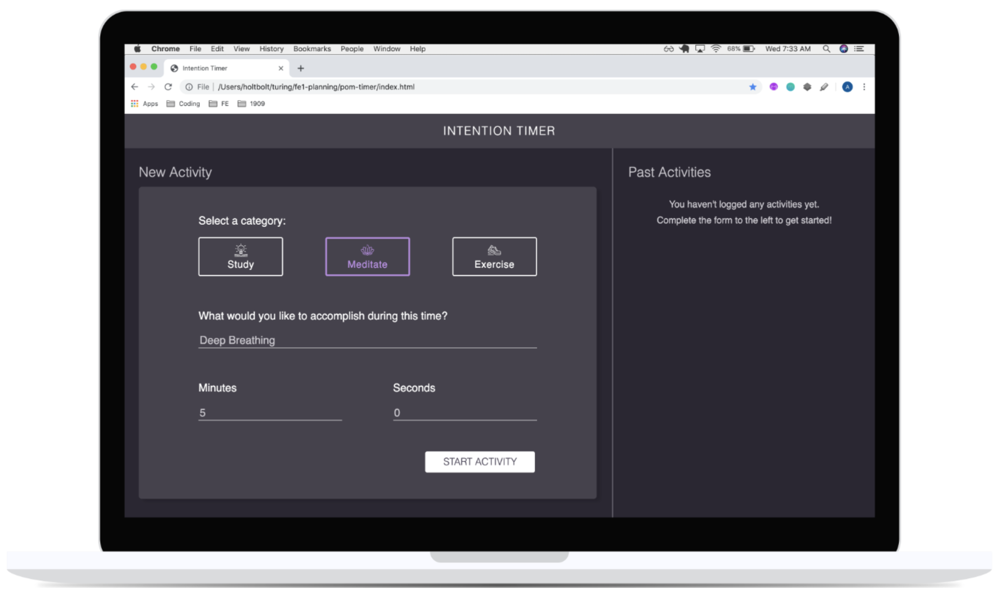
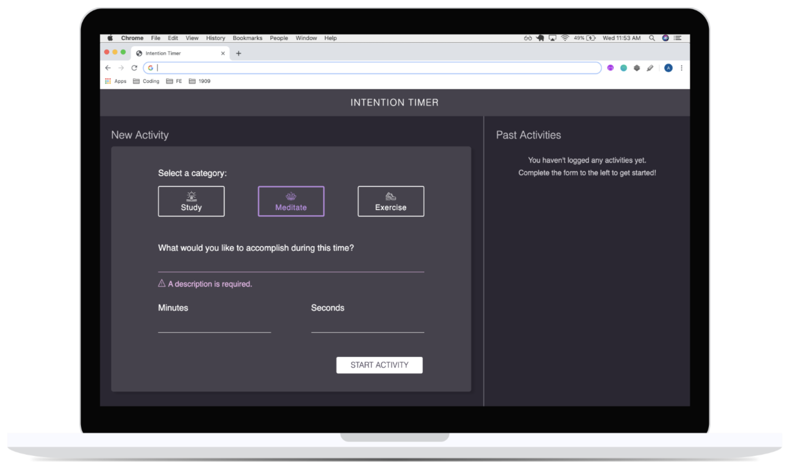
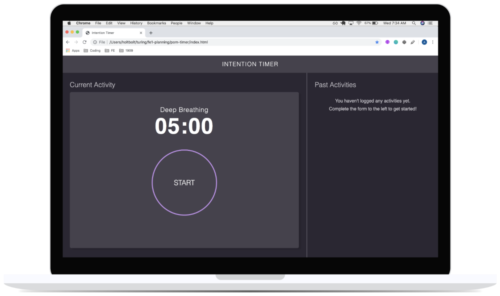

# Intention-Timer

Intention-Timer is the first paired project for our FE Mod 1. We were given an
image of a website and asked to recreate a site that resembles
the image as closely as possible.

## The Design Comp

### Hex Codes:

* Main background: #2B2733
* Text on main background: #CBC9CF
* Header, cards: #46424D
* Text on header and cards: #FFF
* Study: #B3FD78
* Meditate: #C278FD
* Exercise: #FD8078
* Error: #EFB7EC

### The Iterations:

#### Iteration 0

* Build the layout with HTML & CSS

#### Iteration 1 - Form Functionality

* Form Functionality
  * When an activity category is clicked on (Exercise, Meditate, or Study), the associated border and icon should change colors to give a visual indication that it has been selected.
  * An input field should be provided for What would you like to accomplish during this time?, minutes and seconds. The minutes and seconds fields should only accept numbers.
  * A Start Activity button is provided to submit the data entered into the form. When the button is clicked, the user should no longer see the form, and instead see a timer clock.
  * If the Start Activity button is clicked before the user has entered information into all four inputs, the user will receive an error message, but will not lose any information that was provided.

#### Iteration 2 - Build an MVP

* The user can start the time by clicking Start.
* While timer is running, the user should see it count down by second.
* When the timer completes, an alert appears in the browser, letting the user know that the time is up.

## My Finished site

[The GitHub Repository](https://github.com/joel-oe-lacey/Intention-Timer)
